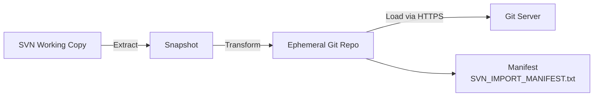

# svn-2-git (snapshot importer)

A portable Go program that snapshots a local SVN working copy and pushes it to a Git remote over HTTPS. No external binaries required.

## Build

```bash
make tidy
make build
```

## Usage

```bash
./bin/svn_to_git --source /path/to/svn/working-copy \
  --target https://git.example.com/owner/repo.git \
  --user myuser --password mytoken
```

Optional flags:
- `--author-name`, `--author-email`
- `--message`
- `--workdir` (defaults to temp)
- `--dry-run`
- `--debug`
- `--insecure` (skip TLS verify)

The tool performs an ETL pipeline:
- Extract: walk the working copy, ignoring `.svn`.
- Transform: initialize a Git repo, copy files, create a single commit, add an `SVN_IMPORT_MANIFEST.txt` for traceability.
- Load: push to the remote via HTTPS using basic auth.

Environment variables: `GIT_USER`, `GIT_PASSWORD`, `GIT_AUTHOR_NAME`, `GIT_AUTHOR_EMAIL`.

Limitations: this performs a one-shot snapshot import; it does not attempt to preserve SVN history or annotations.

## Docker

Build container image:
```bash
docker build -t local/svn2git:dev .
```

Run in container:
```bash
docker run --rm -it \
  -v /path/to/working-copy:/src:ro \
  local/svn2git:dev \
  --source /src --target https://git.example.com/owner/repo.git \
  --user "$GIT_USER" --password "$GIT_PASSWORD"
```

## Test infrastructure

Fast path: run the full end-to-end example orchestrator. It will start SVN and Git containers, export the SVN working copy to the host, build the importer image, and execute the ETL.
```bash
./test/run_etl_example.sh
```

Manual steps if preferred:
```bash
./test/run-svn-sample.sh
./test/run-git-sample.sh
# export working copy from svn container to /tmp/svn-wc
mkdir -p /tmp/svn-wc
docker exec svn-sample bash -lc 'tar -C /tmp/wc -cf - .' | tar -C /tmp/svn-wc -xf -
docker build -t local/svn2git:dev .
docker run --rm --network scm-playground -v /tmp/svn-wc:/src:ro local/svn2git:dev \
  --source /src --target http://git-sample:3000/<user>/<repo>.git \
  --user <user> --password <pass>
```




