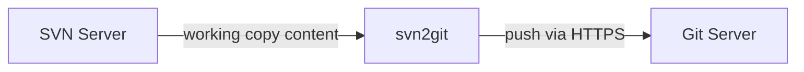

# Test environment

This folder contains two helper scripts that spin up throwaway SCM servers on a shared Docker network so you can exercise the `svn2git` importer end-to-end.

- Network name: `scm-playground`
- Topology: an SVN server and a Git server (Gogs) reachable by name from the `svn2git` container.

## Scripts

- `run-svn-sample.sh`
  - Starts an SVN server container and initializes a repository at `svn://svn-sample:3690/repo`.
  - Checks out a working copy inside the container, creates a mix of structured and random files, commits them, and leaves the server running.

- `run-git-sample.sh`
  - Starts a minimal Git server using Gogs on the same network.
  - Web UI: `http://localhost:3000/`. Create a user and a repository (e.g., `repo`).

## Typical flow

1) Start the servers:
```bash
./run-svn-sample.sh
./run-git-sample.sh
```

2) Export the SVN working copy to the host so the importer can read it:
```bash
# Copies /tmp/wc from the svn container to /tmp/svn-wc on the host
mkdir -p /tmp/svn-wc
container=svn-sample
docker exec "$container" bash -lc 'tar -C /tmp/wc -cf - .' | tar -C /tmp/svn-wc -xf -
```

3) Build the importer image (from repo root) and run it against the Git server:
```bash
cd ../
docker build -t local/svn2git:dev ..

docker run --rm --network scm-playground \
  -v /tmp/svn-wc:/src:ro local/svn2git:dev \
  --source /src \
  --target http://git-sample:3000/<user>/<repo>.git \
  --user <user> --password <pass> --debug
```

4) Verify in the Git UI; you should see your files and `SVN_IMPORT_MANIFEST.txt`.

5) Cleanup:
```bash
docker rm -f svn-sample git-sample || true
```

## Communication diagram


